<h1 align="center">Hi 👋, I'm Mallikarjun C V</h1>
<h3 align="center">Full-Stack Developer | MERN Stack | AI & Machine Learning</h3>

<!-- 

  

 -->

## 🚀 About Me

- 🎓 Computer Science & Engineering student at GMIT, Davanagere
- 💻 Passionate about Full-Stack Development and Software Engineering
- ⚛️ Building modern web applications using the MERN stack
- 🤖 Exploring Artificial Intelligence and Machine Learning
- 🧠 Interested in problem-solving, algorithms, and new technologies
- 🏥 Developing **Vaidyam**, an AI-integrated healthcare platform
- 🚀 I love turning ideas into real-world projects
- 🌱 Always learning, building, and improving

## 🧠 My Focus Areas

  
  
  

## 📊 GitHub Stats & Trophies

  

  

 

  

## 🛠️ Languages & Technologies

<h3 align="center">Programming Languages</h3>

  
  &nbsp;&nbsp;
  
  &nbsp;&nbsp;
  
  &nbsp;&nbsp;
  

<h3 align="center">Frontend Development</h3>

  
  &nbsp;&nbsp;
  
  &nbsp;&nbsp;
  
  &nbsp;&nbsp;
  
  &nbsp;&nbsp;
  

<h3 align="center">Backend & Database</h3>

  
  &nbsp;&nbsp;
  
  &nbsp;&nbsp;
  
  &nbsp;&nbsp;
  
  &nbsp;&nbsp;
  

<h3 align="center">AI, Machine Learning & Tools</h3>

  
  &nbsp;&nbsp;
  
  &nbsp;&nbsp;
  
  &nbsp;&nbsp;
  
  &nbsp;&nbsp;
  

## 🌱 Currently Learning

- 🌐 Modern Web Development with React and Next.js
- 🤖 Deep Learning and Neural Networks
- 📊 Data Visualization and Analytics
- ⚡ Building and deploying real-world applications

## 🎮 Fun Corner

  

## 💬 Fun Facts

- 🫣 Seeing others code fuels my coding motivation
- 💡 I love turning random ideas into small projects
- 🎮 I enjoy exploring games and experimenting with new tech

## 📫 Connect with Me

  
  &nbsp;
  

  ✨ <b>Explore my repositories and let's build something amazing!</b>

  

